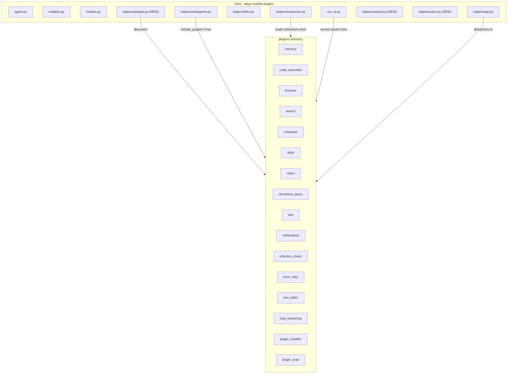

# A1: Plugin System — Implementation Plan

> Phase 2 of the upstream backport project (see `docs/specs/2026-03-28-upstream-backport-design.md`).

## Scope

Implement the full plugin system architecture with `@extensible` decorator, plugin infrastructure (discovery, toggle, config, hooks), and migrate all domain-specific functionality into 16 plugins, preserving fork customizations (Cognee, CDP, skills marketplace).

### User decisions (from planning phase)

- **Migration scope**: Full spec — all 16 plugins, not just the 9 migrated upstream
- **@extensible decorator**: Included in A1 (originally planned for A3)
- **model_config plugin**: Deferred (requires A4/AgentConfig slimming)

---

## Architecture Overview



## Key Design Decisions

- **Manifest format**: `plugin.yaml` (matches upstream latest)
- **Naming**: no underscore prefix (e.g., `memory` not `_memory`)
- **@extensible**: included in A1 — enables plugin hooks via `start`/`end` extension points
- **API dispatch**: plugin API handlers registered at `/plugins/<name>/<handler>` with backward-compat shims at old routes
- **Toggle system**: `.toggle-0`/`.toggle-1` files, per-project and per-agent overrides
- **Plugin config**: `default_config.yaml` in plugin dir, `config.json` for user overrides
- **Backward compatibility**: Thin re-export shims at old `helpers/*.py` and `api/*.py` locations

## Plugin Directory Convention

```
plugins/<name>/
  plugin.yaml              # manifest (required)
  default_config.yaml      # optional defaults
  hooks.py                 # optional lifecycle hooks
  initialize.py            # optional init script
  tools/                   # tool .py files (discovered via get_paths)
  extensions/python/<hook>/  # python extensions (discovered via get_paths)
  extensions/webui/<hook>/   # webui extensions (HTML/JS)
  helpers/                 # plugin-specific helpers (imported directly)
  api/                     # API handlers
  prompts/                 # prompt templates
  webui/                   # UI components (main.html, config.html)
  agents/                  # agent profiles provided by plugin
```

---

## Tasks

### Sub-phase 1: Infrastructure

| ID | Task | Status |
|----|------|--------|
| infra-new-helpers | Create `helpers/cache.py`, `helpers/yaml.py`, add missing functions to `helpers/files.py` | ✅ |
| infra-plugins-py | Create `helpers/plugins.py` with full plugin discovery, toggle, config, hooks | ✅ |
| infra-extensible | Rewrite `helpers/extension.py`: add `@extensible` decorator, split async/sync, webui extensions, plugin path integration | ✅ |
| infra-subagents | Update `helpers/subagents.py`: add `include_plugins` param, plugin agent merging | ✅ |
| infra-api-dispatch | Update `helpers/api.py` + `run_ui.py`: dynamic API dispatch, plugin asset routes | ✅ |
| infra-api-plugins | Create `api/plugins.py` endpoint for plugin management | ✅ |

#### New files
- **helpers/cache.py** — thread-safe in-memory cache with pattern-based invalidation
- **helpers/yaml.py** — thin wrapper around PyYAML (`loads`, `dumps`, `from_json`, `to_json`)
- **helpers/plugins.py** — full plugin system: `get_plugin_roots()`, `get_plugins_list()`, `get_enhanced_plugins_list()`, `find_plugin_dir()`, `get_plugin_meta()`, `get_enabled_plugins()`, `get_enabled_plugin_paths()`, `toggle_plugin()`, `get_toggle_state()`, `get_plugin_config()`, `save_plugin_config()`, `call_plugin_hook()`, `after_plugin_change()`, `find_plugin_assets()`, `determine_plugin_asset_path()`
- **api/plugins.py** — plugin management API (list, toggle, get/save config, uninstall)

#### Modified files
- **helpers/files.py** — constants `PLUGINS_DIR`, `USER_DIR`, `AGENTS_DIR`; functions `read_file_yaml()`, `read_file_json()`, `is_file()`, `is_dir()`, `delete_file()`
- **helpers/extension.py** — `@extensible` decorator, `call_extensions_async`, `call_extensions_sync`, `get_webui_extensions()`, cache-based extension loading
- **helpers/subagents.py** — `include_plugins` param in `get_paths()`, plugin agent merging in `get_agents_dict()` and `load_agent_data()`, `agent.yaml` support
- **run_ui.py** — plugin asset serving routes, plugin API handler registration

---

### Sub-phase 2: Simple Plugin Migrations (extension-only)

| ID | Task | Status |
|----|------|--------|
| migrate-simple | Create `error_retry` and `infection_check` plugins (new from upstream) | ✅ |

---

### Sub-phase 3: Tool + Helper Plugin Migrations

| ID | Task | Status |
|----|------|--------|
| migrate-memory | Migrate memory plugin (tools + helpers + extensions + API), preserve Cognee customizations | ✅ |
| migrate-code-exec | Migrate code_execution plugin (tools + helpers) | ✅ |
| migrate-browser | Migrate browser plugin (tool + helpers), preserve CDP monkeypatch | ✅ |
| migrate-search | Migrate search plugin (tool + helpers) | ✅ |
| migrate-scheduler | Migrate scheduler plugin (tool + helpers + API) | ✅ |
| migrate-skills | Migrate skills plugin (tool + helpers + API + extensions), preserve marketplace | ✅ |
| migrate-small | Migrate vision, document_query, a2a, notifications plugins | ✅ |

#### Migration approach
- `git mv` for all file moves to preserve history
- Backward-compat shims at old `helpers/*.py` locations (re-export via `from plugins.*.helpers.* import *`)
- Backward-compat shims at old `api/*.py` locations for API handlers
- Cross-plugin references updated (e.g., `from tools.skills_tool import` → `from plugins.skills.tools.skills_tool import`)

#### Plugins migrated (12 existing → plugin directories)
- **memory**: 5 tools, 6 helpers, 6 extensions, 5 API handlers
- **code_execution**: 2 tools, 4 helpers
- **browser**: 1 tool, 3 helpers
- **search**: 1 tool, 3 helpers
- **scheduler**: 1 tool, 2 helpers, 6 API handlers
- **skills**: 1 tool, 3 helpers, 3 API handlers, 3 extensions
- **vision**: 1 tool
- **document_query**: 1 tool, 1 helper
- **a2a**: 1 tool, 2 helpers
- **notifications**: 1 tool, 1 helper, 4 API handlers

---

### Sub-phase 4: New Plugins from Upstream

| ID | Task | Status |
|----|------|--------|
| migrate-upstream-new | Create text_editor, chat_branching, plugin_installer, plugin_scan | ✅ |

- **text_editor**: File read/write/patch tool
- **chat_branching**: Chat branch-from-message API
- **plugin_installer**: ZIP/Git plugin installation helpers
- **plugin_scan**: Plugin scanning/indexing (stub)

---

### Sub-phase 5: Cleanup and Integration

| ID | Task | Status |
|----|------|--------|
| cleanup-tests | Update all test imports, run full test suite, fix failures, update CI/docs | ✅ |

- Updated ~50 test files with new import paths
- Fixed `patch()` targets to point to real modules (not shims)
- Fixed underscore-prefixed name re-exports
- Updated AGENTS.md architecture docs
- Updated `.github/workflows/ci.yml` path triggers to include `plugins/**`
- **Final result: 2556 passed, 2 skipped, 0 failures**

---

## Risk Mitigation (executed)

1. **Backward compatibility**: Thin re-export shims at old `helpers/*.py` and `api/*.py` locations — existing code continues to work
2. **Circular imports**: Plugin helpers import core helpers, never the reverse
3. **Test stability**: Full test suite run after each sub-phase, all 2556 tests pass
4. **Cognee/CDP**: Files moved with `git mv` preserving history, no functional changes
5. **API routes**: Backward-compat shims ensure all 85 existing API endpoints still resolve at old paths

## Files Summary

- **New files**: ~30 (plugins.py, cache.py, yaml.py, api/plugins.py, 16 plugin.yaml manifests, default_config.yaml files, new plugin code)
- **Moved files**: ~45 (tools, helpers, extensions → plugins/)
- **Shim files**: ~43 (25 helper shims + 18 API shims)
- **Modified files**: ~10 (extension.py, subagents.py, files.py, run_ui.py, AGENTS.md, ci.yml)
- **Updated test files**: ~50 (import rewrites, patch target fixes)
